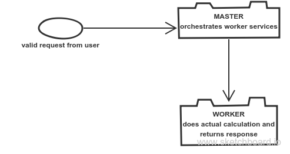

# changecalculator implementation with kotlin, spring-cloud and docker

##Services



##run from docker hub
images have been pushed to docker hub.
I use docker for mac on my local machine.
If you use docker-machine, make sure you have a machine started up.

you can simply run:
```
docker-compose up
```
visit [Localhost](http://localhost:8082/change/<amount>)

###MANUALLY

To build docker images for each individual service, `cd` into the service folder and run: 
```
./gradlew buildDocker
```
or simply run attached `build-docker-images.sh` shell script.

###Compose Up
To start all the services from the command line, just run `docker-compose up`.

###Run All Tests
To run all tests run the `run-all-tests.sh` script.

###URIs/Endpoints
- [Calculator Service](http://localhost:8081/optimalChange/<amount>)
- [Master Service](http://localhost:8082/change/<amount>)

#Entry point in docker for debug. 
FYI I couldn't get this to work
```
"java","-Djava.security.egd=file:/dev/.urandom/","-Xdebug","-Xrunjdwp:server=y,transport=dt_socket,suspend=n","-jar","/app.jar"
```

###For Integration Tests

#Added the following to IDE configurations but they are exported when you run 
run the `run-integration-tests.sh` script.

